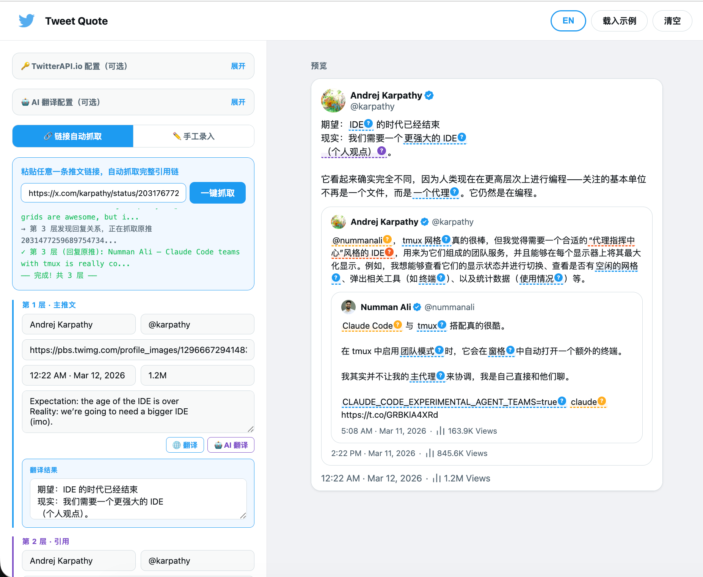
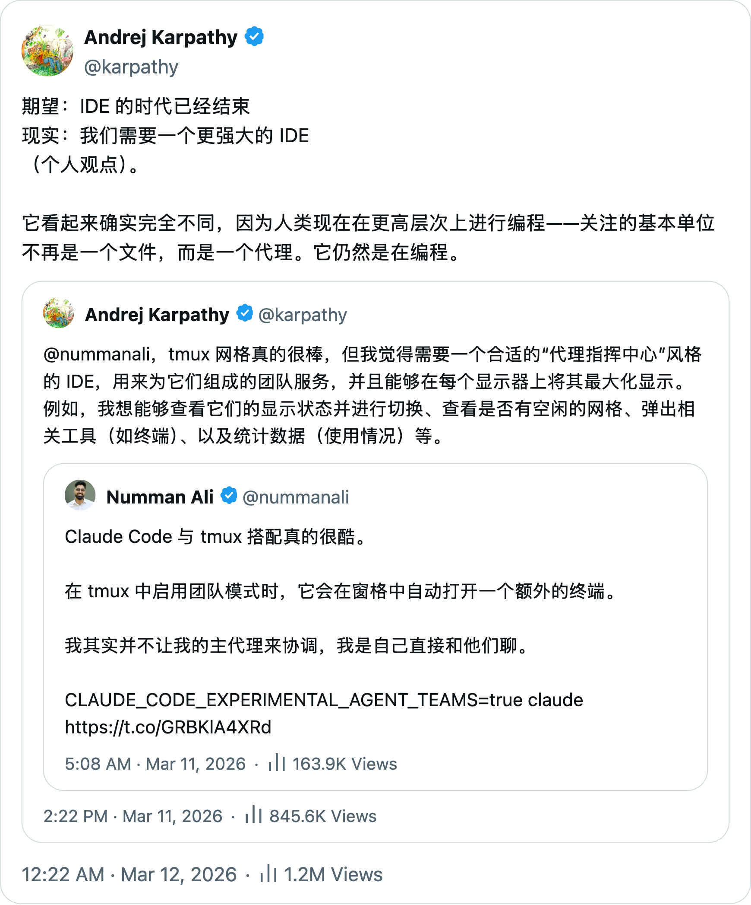

# TweetQuote

> **引用链，一键成图** · *One image, full context*

把 Twitter 推文引用链变成一张可分享的高清图片，支持翻译与 AI 智能注释。

🌐 [tweetquote.app](https://tweetquote.app)

## 截图

| 主界面 | 导出预览 |
|--------|----------|
|  |  |

## 快速开始

### 前置要求

- [Node.js 18+](https://nodejs.org/)
- npm 9+（随 Node.js 一起安装）

### 运行步骤

```bash
# 1. 克隆项目
git clone https://github.com/yangwenmai/tweetquote.git
cd tweetquote

# 2. 安装依赖
npm install

# 3.（可选）初始化本地 SQLite 数据库
npm run db:push -w @tweetquote/api

# 4.（可选）复制并编辑环境变量
cp .env.local.example .env.local

# 5. 启动 API 和 Web（在两个终端分别运行）
npm run dev:api
npm run dev:web
```

启动成功后：
- API 服务：`http://localhost:8787`
- Web 编辑器：`http://localhost:3000`

## 功能特性

| 功能 | 说明 |
|------|------|
| 🔗 **链接自动抓取** | 粘贴推文链接，自动抓取完整引用链（需 [TwitterAPI.io](https://twitterapi.io) API Key） |
| ✏️ **手工录入** | 手动添加多层级推文，自由编辑 |
| 🌐 **翻译** | Google 翻译 / AI 翻译（OpenAI 兼容 API） |
| 🤖 **AI 智能注释** | 翻译时自动标注术语、俚语、文化背景等，悬停查看解释 |
| 📤 **导出 PNG** | 支持 1x/2x/3x 倍率导出高清图片 |
| 🌍 **中英切换** | 界面支持中文、英文 |
| 🧩 **浏览器插件** | MV3 Chrome 插件，直接在 Twitter/X 页面上使用 |

## 配置

### AI 翻译（可选）

在项目根目录创建 `.env.local`：

```env
LLM_PROVIDER=openai
OPENAI_API_KEY=sk-your-key
OPENAI_BASE_URL=https://api.openai.com/v1
OPENAI_MODEL=gpt-4o-mini
```

也支持 Aiberm、Ollama 等 OpenAI 兼容服务，只需修改 `OPENAI_BASE_URL`。

### TwitterAPI.io（可选）

用于链接自动抓取。可在 `.env.local` 中配置 `TWITTERAPI_KEY` 作为默认，或在界面「高级设置」中填入 API Key。访问 [twitterapi.io](https://twitterapi.io) 获取 Key。

## 项目结构

```
tweetquote/
├── apps/
│   ├── api/             # Fastify API（端口 8787）
│   ├── web/             # Next.js Web 编辑器（端口 3000）
│   └── extension/       # MV3 浏览器插件
├── packages/
│   ├── domain/          # 共享 schema 和领域模型
│   ├── editor-core/     # 编辑命令和草稿工具
│   ├── render-core/     # 预览摘要和渲染选择器
│   ├── sdk/             # API 客户端和插件桥接类型
│   ├── ui/              # 共享 UI 组件和引用预览渲染器
│   ├── config/          # 运行时配置和 feature flags
│   └── telemetry/       # 日志和性能钩子
├── landing/             # 营销落地页（独立静态页）
├── legacy/              # V1 旧版归档（server.py + index.html）
├── screenshots/         # 项目截图
├── docs/                # 设计与架构文档
├── .env.local           # 环境变量（不提交）
├── package.json         # Monorepo 根配置
└── LICENSE              # MIT
```

## 常用命令

```bash
# 安装依赖
npm install

# 本地开发
npm run dev:api          # 启动 API 服务
npm run dev:web          # 启动 Web 编辑器
npm run dev:extension    # 启动浏览器插件开发

# 构建
npm run build            # 构建全部应用和包

# 类型检查
npm run typecheck        # 全部工作区类型检查

# 数据库
npm run db:push -w @tweetquote/api    # 初始化/同步 SQLite schema

# 生产运行
npm run start -w @tweetquote/api      # 运行 API 生产构建
npm run start -w @tweetquote/web      # 运行 Web 生产构建
```

## 常见问题

<details>
<summary><strong>Q: 启动报错 <code>Cannot find module</code></strong></summary>

确认已运行 `npm install`。如果问题持续，尝试删除 `node_modules` 和 `package-lock.json` 后重新安装。
</details>

<details>
<summary><strong>Q: API 启动失败</strong></summary>

确认 Node.js 版本 >= 18。运行 `node --version` 检查。如果使用了 Prisma，需要先运行 `npm run db:push -w @tweetquote/api` 初始化数据库。
</details>

<details>
<summary><strong>Q: 不配置 API Key 能用吗？</strong></summary>

可以。手动录入推文内容 + Google 翻译无需任何 Key。只有「链接自动抓取」和「AI 翻译/注释」需要对应的 API Key。
</details>

<details>
<summary><strong>Q: legacy/ 目录是什么？</strong></summary>

`legacy/` 目录包含 V1 旧版代码（Python `server.py` + 单文件 `index.html`），已归档不再维护。当前项目使用 TypeScript monorepo 架构。
</details>

## 详细文档

- [docs/README.md](docs/README.md) — **文档索引**
- [docs/LOCAL_DEVELOPMENT.md](docs/LOCAL_DEVELOPMENT.md) — 本地运行操作指引
- [docs/SERVER_DEPLOYMENT.md](docs/SERVER_DEPLOYMENT.md) — 服务器部署与运维
- [docs/ARCHITECTURE.md](docs/ARCHITECTURE.md) — 架构设计
- [docs/FEATURES.md](docs/FEATURES.md) — 功能文档
- [docs/DESIGN_BASELINE.md](docs/DESIGN_BASELINE.md) — 产品设计与交互基准

## 参与贡献

欢迎提交 Issue 和 Pull Request！

1. Fork 本仓库
2. 创建你的功能分支 (`git checkout -b feature/my-feature`)
3. 提交更改 (`git commit -m 'feat: add some feature'`)
4. 推送到分支 (`git push origin feature/my-feature`)
5. 提交 Pull Request

## License

[MIT](LICENSE) — 你可以自由使用、修改和分发本项目。
